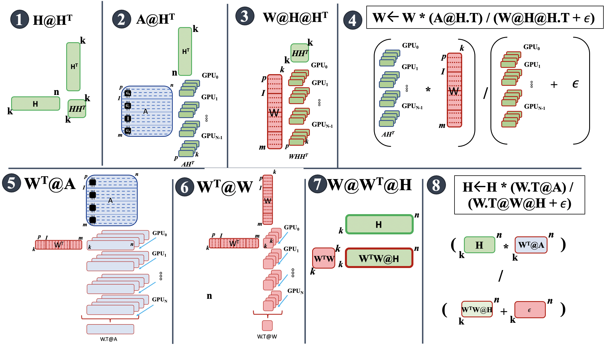
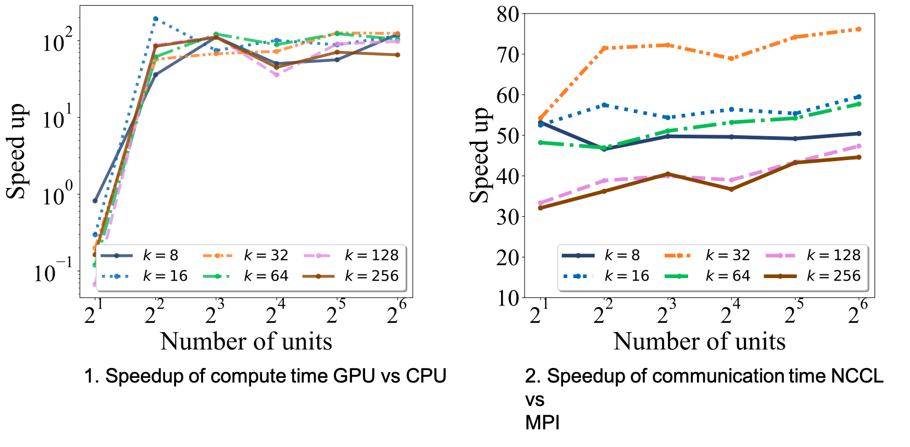
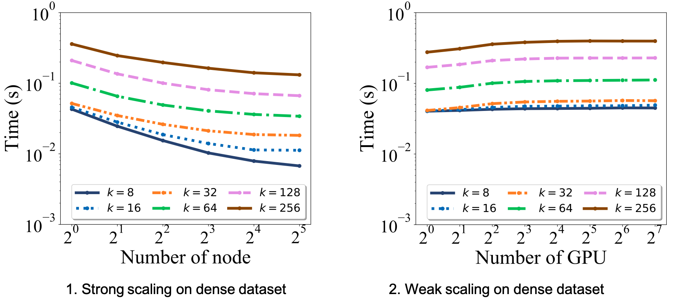

# [cuda-pyDNMFk: Cuda Python Distributed Non Negative Matrix Factorization with determination of hidden features](https://github.com/lanl/pyDNMFk)  
  
  
<div align="center", style="font-size: 50px">  
  
[](https://github.com/lanl/Distributed_pyNMFk/actions/workflows/ci_test.yml/badge.svg?branch=main) [](https://img.shields.io/badge/License-BSD%203--Clause-blue.svg) [](https://img.shields.io/badge/python-v3.7.1-blue) [](https://doi.org/10.5281/zenodo.4722448)  
  
</div>  
  
<br>  
  
cuda-pyDNMFk is a dynamic software platform tailored for the decomposition of large datasets that surpass the limitations of in-memory processing. Building on its foundational capabilities, the latest branch introduces significant enhancements, enabling out-of-memory and distributed decomposition. This ensures that datasets, regardless of their size, can be effectively processed across distributed CPU/GPU architectures. By leveraging advanced GPU functionalities provided by libraries like CuPy and integrating efficient sparse matrix manipulations, cuda-pyDNMFk ensures rapid, efficient, and scalable performance. Whether you're working on a single GPU setup or a multi-node GPU cluster, pyDNMFk offers a robust solution for handling massive datasets seamlessly.  
<hr/>  
  
  
  
  
 
# Features of Distributed Out-of-Memory NMF Implementation  
  
- **Efficiency on HPC Systems:** Optimized for heterogeneous high-performance-computing systems to tackle large datasets.  
    
- **NMFk Foundation:** Builds upon the proven capabilities of NMFk, which is known for automatic model selection and extraction of latent variables.  
    
- **Extended Support:**  Adds the ability to handle both dense and sparse matrix operations across multi-node, multi-GPU systems.  
    
- **Out-of-Memory Solutions:**  Designed for situations where the memory demand for factorizing a matrix exceeds the available GPU memory, by employing batching/tiling strategies.  
    
- **GPU Acceleration:**  Enhances matrix operations through the power of GPU cores and tensor cores (when available) for maximum speed.  
    
- **Optimized Data Transfers:**  Uses CUDA streams to minimize I/O latency by overlapping data transfers and computations.  
    
- **Enhanced Communications:**  Implements NVIDIA Collective Communication Library (NCCL) for streamlined intra-node and inter-node communications.  
    
- **Impressive Benchmarks:** Achieves significant speedups, with up to 76x improvement over the traditional CPU-based NMFk.  
    
- **Scalability:**   Demonstrates good weak scaling on large multi-GPU clusters, proven to work on decomposing matrices of up to 11 Exabyte-size with a density of \(10^{-6}\).  
  
  
  
  
**Figure: Overview of the cuda-pyDNMFk out-of-memory and distributed memory algorithm.**  
## Installation:  
  
  
```  
git clone https://github.com/lanl/pyDNMFk.git  
cd pyDNMFk  
conda create --name cudaNMF --file conda_env_requirements.txt  
conda activate cudaNMF  
python setup.py install  
```  
  
  
## Prerequisites:  
* conda  
* numpy>=1.2  
* matplotlib  
* MPI4py  
* scipy  
* h5py  
* cupy  
* NCCL  
  
## Documentation  
  
You can find the documentation [here](https://lanl.github.io/pyDNMFk/).   
  
  
## Usage  

  
We provide a sample dataset that can be used for estimation of k:  
```python  
  
import sys  
import pyDNMFk.config as config  
  
config.init(0)  
from pyDNMFk.pyDNMFk import *  
from pyDNMFk.utils import *  
from pyDNMFk.dist_comm import *  
from scipy.io import loadmat  
  
  
def dist_nmfk_1d_nnsvd_init_wtsi(nGPUs=None,nccl_comm=None, topology=None ):  
 args = parse() args.use_gpu = True args.use_gpu = False    
 args.gpu_partition = 'row'     args.IMAX = 40960 #1024 #2048 #512 #256  
 args.JMAX = 40960 #1024 #2048 #512 #256 args.A_Is_Larage = True args.A_Is_Larage = False  
 args.init = 'rand' rank = comm.rank size = comm.size if args.use_gpu: if nGPUs is None: nGPUs = size else: nGPUs = size  
 args.fpath = '../data/'  
 args.fname,args.ftype = 'US_11260_15056', 'npy'  
 if args.use_gpu: try: partition_type = args.gpu_partition.lower() if partition_type in ['row', 'row1', '1row' ,'row_1d', '1d_row']: args.gpu_partition = 'row_1d' elif partition_type in ['col', 'col1', '1col' ,'col_1d', '1d_col', 'column', 'column_1d', '1d_column']: args.gpu_partition = 'col_1d' elif partition_type in ['auto', 'optim', 'optimal']: args.gpu_partition = 'auto' else: raise Exception(f"[!!] GPU grid partition {args.gpu_partition} is not supported. Try 'auto', 'column', 'row'") except: args.gpu_partition = 'auto'    if args.gpu_partition in ['row_1d']:  
 p_r, p_c = 1, nGPUs # Row METHOD = 'Row_1d' elif args.gpu_partition in ['col_1d']: p_r, p_c = nGPUs, 1  # Col METHOD = 'Col_1d' else:                     #AUTO if rank == 0: print(f'[!!][AUTO GPU PARTITION] Trying to find optimal aprtition...') try: NN= args.fname.split('_') if int(NN[1]) < int(NN[2]): p_r, p_c = 1, nGPUs # Row METHOD = 'Row_1d' else: p_r, p_c = nGPUs, 1  # Col METHOD = 'Col_1d' if rank == 0: print(f"[!!][AUTO GPU PARTITION] {METHOD} GPU partition selected")        except:  
 print(f'[!!] USING DEFAULT METHOD') p_r, p_c, METHOD = nGPUs, 1, 'Col_1d'  # Col #p_r, p_c, METHOD = 1, nGPUs, 'Row_1d'  # Row  
 comms = MPI_comm(comm, p_r, p_c) comm1 = comms.comm args.size, args.rank, args.comm, args.p_r, args.p_c = size, rank, comms, p_r, p_c args.row_comm, args.col_comm, args.comm1 = comms.cart_1d_row(), comms.cart_1d_column(), comm1 rank = comms.rank #if rank == 0: print(f"Running {METHOD}")    args.start_k = 8  
 args.end_k = 128 #args.k = 4 args.step = 8 args.sill_thr = 0.6 args.itr = 1000 args.verbose = True args.norm = 'fro' args.method = 'mu' args.precision = np.float32 args.checkpoint = False A_ij = data_read(args).read().astype(args.precision)  
 args.results_path = '../results/' m,n            =  A_ij.shape J              =  min(args.JMAX, n) args.nGPUs     = nGPUs args.grid_m    = m args.grid_m    = n args.grid_m    = J  
 nopt = PyNMFk(A_ij, factors=None, params=args).fit()  
from mpi4py import MPI  
comm        = MPI.COMM_WORLD  
size        = comm.Get_size()  
rank        = comm.Get_rank()  
  
import cupy as cp  
from cupy.cuda import nccl  
from pyDNMFk.communicators import NCCLComm  
from pyDNMFk.comm_utils import GetTopology  
  
dist_nmfk_1d_nnsvd_init_wtsi(nGPUs=size)  
```  
  
See the resources for more use cases.  
<hr/>  
  
## Benchmarking  
  
  
  **Figure: Scaling benchmarks for 10 iterations for Frobenius norm based MU updates with MPI vs NCCL 
for 1) compute and 2) communication timings** 
  
## Scalability  
  
  **Figure: Scaling benchmarks for 10 iterations for Frobenius norm based MU updates with NCCL 
 operations for 1) strong and 2) weak scaling** 
## Authors:  
* [Ismael Boureima](mailto:iboureima@lanl.gov) - Los Alamos National Laboratory  
* [Manish Bhattarai](mailto:ceodspspectrum@lanl.gov) - Los Alamos National Laboratory  
* [Erik Skau](mailto:ewskau@lanl.gov) - Los Alamos National Laboratory  
* [Maksim Eren](mailto:maksim@lanl.gov) - Los Alamos National Laboratory  
* [Boian Alexandrov](mailto:boian@lanl.gov) - Los Alamos National Laboratory  
  
## Citation:  
  
```latex  
 @misc{rw2019timm, author = {Ismael Boureima, Manish Bhattarai, Erik Skau, Maksim Eren, Boian ALexandrov},
title = {cuda-pyDNMFk: Cuda Python Distributed Non Negative Matrix Factorization}, year = {2021}, publisher
 = {GitHub}, journal = {GitHub repository}, doi = {10.5281/zenodo.4722448}, howpublished = {\url{https://github.com/lanl/pyDNMFk}}}  
  
@article{boureima2022distributed,  
 title={Distributed out-of-memory nmf of dense and sparse data on cpu/gpu architectures with automatic model
 selection for exascale data}, author={Boureima, Ismael and Bhattarai, Manish and Eren, Maksim and Skau,
Erik and Romero, Philip and Eidenbenz, Stephan and Alexandrov, Boian}, journal={arXiv preprint arXiv:2202.09518},
 year={2022}}  
  
  ```  
  
## Acknowledgments:  
Los Alamos National Lab (LANL), T-1  
  
## Copyright Notice:  
  
© (or copyright) 2020. Triad National Security, LLC. All rights reserved.  
This program was produced under U.S. Government contract 89233218CNA000001 for Los Alamos  
National Laboratory (LANL), which is operated by Triad National Security, LLC for the U.S.  
Department of Energy/National Nuclear Security Administration. All rights in the program are  
reserved by Triad National Security, LLC, and the U.S. Department of Energy/National Nuclear  
Security Administration. The Government is granted for itself and others acting on its behalf a  
nonexclusive, paid-up, irrevocable worldwide license in this material to reproduce, prepare  
derivative works, distribute copies to the public, perform publicly and display publicly, and to permit  
others to do so.  
  
## License:  
  
This program is open source under the BSD-3 License.  
Redistribution and use in source and binary forms, with or without  
modification, are permitted provided that the following conditions are met:  
  
1. Redistributions of source code must retain the above copyright notice, this  
   list of conditions and the following disclaimer.  
  
2. Redistributions in binary form must reproduce the above copyright notice,  
   this list of conditions and the following disclaimer in the documentation  
   and/or other materials provided with the distribution.  
  
3. Neither the name of the copyright holder nor the names of its  
   contributors may be used to endorse or promote products derived from  
   this software without specific prior written permission.  
  
THIS SOFTWARE IS PROVIDED BY THE COPYRIGHT HOLDERS AND CONTRIBUTORS "AS IS"  
AND ANY EXPRESS OR IMPLIED WARRANTIES, INCLUDING, BUT NOT LIMITED TO, THE  
IMPLIED WARRANTIES OF MERCHANTABILITY AND FITNESS FOR A PARTICULAR PURPOSE ARE  
DISCLAIMED. IN NO EVENT SHALL THE COPYRIGHT HOLDER OR CONTRIBUTORS BE LIABLE  
FOR ANY DIRECT, INDIRECT, INCIDENTAL, SPECIAL, EXEMPLARY, OR CONSEQUENTIAL  
DAMAGES (INCLUDING, BUT NOT LIMITED TO, PROCUREMENT OF SUBSTITUTE GOODS OR  
SERVICES; LOSS OF USE, DATA, OR PROFITS; OR BUSINESS INTERRUPTION) HOWEVER  
CAUSED AND ON ANY THEORY OF LIABILITY, WHETHER IN CONTRACT, STRICT LIABILITY,  
OR TORT (INCLUDING NEGLIGENCE OR OTHERWISE) ARISING IN ANY WAY OUT OF THE USE  
OF THIS SOFTWARE, EVEN IF ADVISED OF THE POSSIBILITY OF SUCH DAMAGE.
