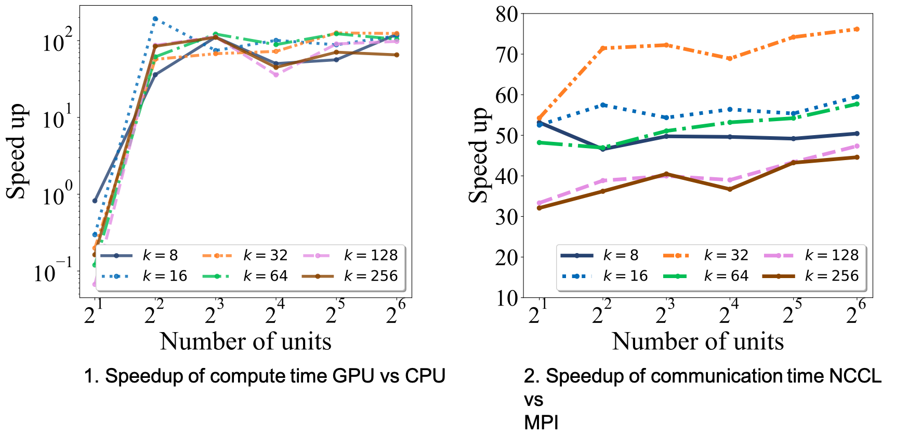

.. cuda-pyDNMFk documentation master file, created by
   sphinx-quickstart on Fri Aug 11 14:03:08 2023.
   You can adapt this file completely to your liking, but it should at least
   contain the root `toctree` directive.

.. _cuda-pyDNMFk: Cuda Python Distributed Non Negative Matrix Factorization with determination of hidden features: https://github.com/lanl/pyDNMFk

==============================================================================================================
cuda-pyDNMFk: Cuda Python Distributed Non Negative Matrix Factorization with determination of hidden features
==============================================================================================================

.. image:: https://github.com/lanl/pyDNMFk/actions/workflows/ci_test.yml/badge.svg?branch=main
   :target: https://github.com/lanl/Distributed_pyNMFk/actions/workflows/ci_test.yml/badge.svg?branch=main

.. image:: https://img.shields.io/badge/License-BSD%203--Clause-blue.svg
   :target: https://img.shields.io/badge/License-BSD%203--Clause-blue.svg

.. image:: https://img.shields.io/badge/python-v3.7.1-blue
   :target: https://img.shields.io/badge/python-v3.7.1-blue

.. image:: https://img.shields.io/badge/DOI-10.5281%2Fzenodo.4722448-blue.svg
   :target: https://doi.org/10.5281/zenodo.4722448

cuda-pyDNMFk is a dynamic software platform tailored for the decomposition of large datasets that surpass the limitations 
of in-memory processing. Building on its foundational capabilities, the latest branch introduces significant enhancements, 
enabling out-of-memory and distributed decomposition. This ensures that datasets, regardless of their size, can be 
effectively processed across distributed CPU/GPU architectures. By leveraging advanced GPU functionalities provided 
by libraries like CuPy and integrating efficient sparse matrix manipulations, cuda-pyDNMFk ensures rapid, efficient, and 
scalable performance. Whether you're working on a single GPU setup or a multi-node GPU cluster, pyDNMFk offers a 
robust solution for handling massive datasets seamlessly.

----------

.. image:: ../pyDNMFk_RD500.png

Features of Distributed Out-of-Memory NMF Implementation
--------------------------------------------------------

- **Efficiency on HPC Systems:** Optimized for heterogeneous high-performance-computing systems to tackle large datasets.
- **NMFk Foundation:** Builds upon the proven capabilities of NMFk, which is known for automatic model selection and extraction of latent variables.
- **Extended Support:**  Adds the ability to handle both dense and sparse matrix operations across multi-node, multi-GPU systems.
- **Out-of-Memory Solutions:**  Designed for situations where the memory demand for factorizing a matrix exceeds the available GPU memory, by employing batching/tiling strategies.
- **GPU Acceleration:**  Enhances matrix operations through the power of GPU cores and tensor cores (when available) for maximum speed.
- **Optimized Data Transfers:**  Uses CUDA streams to minimize I/O latency by overlapping data transfers and computations.
- **Enhanced Communications:**  Implements NVIDIA Collective Communication Library (NCCL) for streamlined intra-node and inter-node communications.
- **Impressive Benchmarks:** Achieves significant speedups, with up to 76x improvement over the traditional CPU-based NMFk.
- **Scalability:**   Demonstrates good weak scaling on large multi-GPU clusters, proven to work on decomposing matrices of up to 11 Exabyte-size with a density of \(10^{-6}\).

.. image:: ../New_bached_Algo_row3.png

**Figure: Overview of the pyDNMFk workflow implementation.**

Installation:
-------------

.. code-block:: bash

   git clone https://github.com/lanl/pyDNMFk.git
   cd pyDNMFk
   conda create --name cudaNMF --file conda_env_requirements.txt
   conda activate cudaNMF
   python setup.py install

Prerequisites:
--------------

- conda
- numpy>=1.2
- matplotlib
- MPI4py
- scipy
- h5py
- cupy
- NCCL

Documentation
-------------

You can find the documentation `here <https://lanl.github.io/pyDNMFk/>`_.

Usage:
------

.. code-block:: python

   # ... [the given Python code]

See the resources for more use cases.

----------

Benchmarking:
-------------

**Figure: Scaling benchmarks for 10 iterations for Frobenius norm based MU updates with MPI vs NCCL for 1) compute and 2) communication timings**

Scalability:
------------

.. image:: ../benchmark_strongweak.png

**Figure: Scaling benchmarks for 10 iterations for Frobenius norm based MU updates with NCCL operations for 1) strong and 2) weak scaling**

Authors:
--------

- `Ismael Boureima <iboureima@lanl.gov>`_ - Los Alamos National Laboratory
- `Manish Bhattarai <ceodspspectrum@lanl.gov>`_ - Los Alamos National Laboratory
- `Erik Skau <ewskau@lanl.gov>`_ - Los Alamos National Laboratory
- `Maksim Eren <maksim@lanl.gov>`_ - Los Alamos National Laboratory
- `Boian Alexandrov <boian@lanl.gov>`_ - Los Alamos National Laboratory

Citation:
---------

.. code-block:: latex

   @misc{rw2019timm, ... }
   @article{boureima2022distributed, ... }

Acknowledgments:
----------------

Los Alamos National Lab (LANL), T-1

Copyright Notice:
-----------------

© (or copyright) 2020. Triad National

Welcome to cuda-pyDNMFk's documentation!
========================================

.. toctree::
   :maxdepth: 2
   :caption: Contents:

   modules

Indices and tables
==================

* :ref:`genindex`
* :ref:`modindex`
* :ref:`search`
